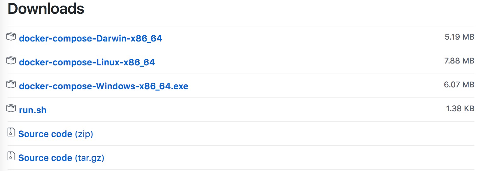

# ELK FOR DOCKER

Run the latest version of ELK stack with docker and docker-compose.

## Requirements

1、docker
2、docker-compose
3、clone this repository

### Docker

refer to 

### Docker-compose

Download it from 


and run:

```shell
sudo mv docker-compose-Linux-x86_64 /usr/local/bin/docker-compose
sudo chmod +x /usr/local/bin/docker-compose
```

### clone

```shell
git clone https://github.com/qianlnk/elk.git
```

## Increase `vm.max_map_count` on your host

You need to increase the `vm.max_map_count` kernel setting on your Docker host.
To do this follow the recommended instructions from the Elastic documentation: [Install Elasticsearch with Docker](https://www.elastic.co/guide/en/elasticsearch/reference/current/docker.html#docker-cli-run-prod-mode)

## SELinux

On distributions which have SELinux enabled out-of-the-box you will need to either re-context the files or set SELinux into Permissive mode in order for docker-elk to start properly.
For example on Redhat and CentOS, the following will apply the proper context:

```shell
$ chcon -R system_u:object_r:admin_home_t:s0 elk/
```

## Usage

start ELK stack with docker-compose:

```shell
docker-compose up
```

usually, run it in tmux.

## Config

### logstash

The logstash config file is stroed in `logstash/config/logstash.yml`
and config `input` `output` in `logstash/pipeline/`.

### elasticsearch

The elasticsearch config file is stored in `elasticsearch/config/elasticsearch.yml`

### How to scale up the elasticsearch cluster

The Elasticsearch container is using the [shipped configuration](https://github.com/elastic/elasticsearch-docker/blob/master/build/elasticsearch/elasticsearch.yml).